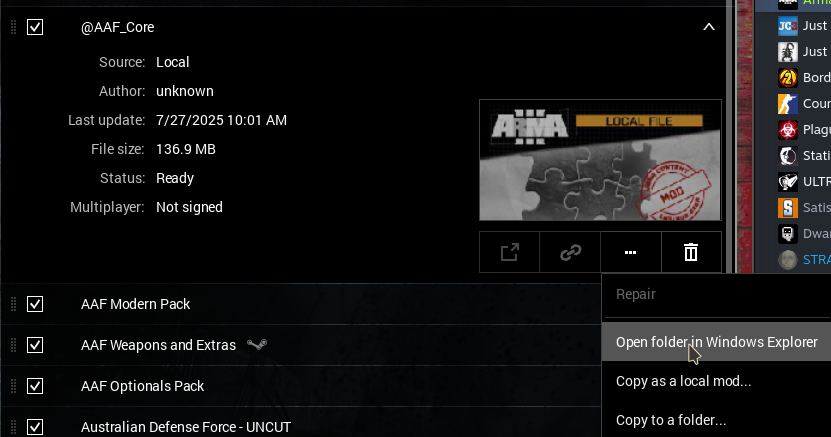
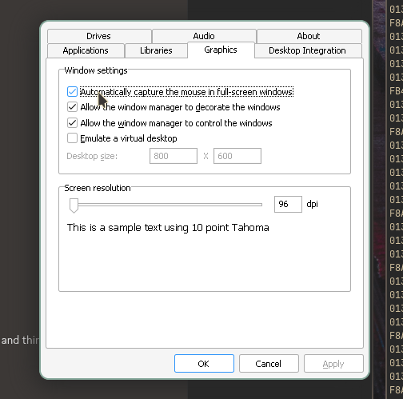

+++
title = "arma 3 on linux"
date = 2025-07-27
+++

# how to get arma 3 running on linux with radio mods
I use nixos, but this should work everywhere that steam can be installed.

Install arma, and download the teamspeak 3 installer. Launch Arma until the launcher. Go to the mods tab and subscribe to a mod if you have not done so already, click the little arrow, then the three drops and select "Open folder in Windows Explorer". This will open a WINE explorer thing, you can launch executables that will run in the same wine instance, using the same wine server from here.

Now, run the teamspeak 3 installer, install for all users and **remember to uncheck the overwolf thing**, once it finished, close Teamspeak. Now you should just be able to launch the game, and for ACERE2 at least, it will install the plugin automatically. I am unsure of what will happen if you use something else, but you can just follow it's guide for installing the plugin. To launch teamspeak again, open the explorer and run `C:/Program Files/TeamSpeak 3 Client/ts3client_win64.exe`

## bonus performance things
In the arma 3 launcher, under parameters, turn on the following:
- Basic
  - Show static background in menu: true
  - Skip logos at startup: true
  - Force window mode: true
- Advanced
  - Extra Threads: true
    - File operations: true
    - Texture loading: true
    - Geometry loading: true
  - No logs: true (this is probably really minimal on performance increase, so maybe don't bother because you may need the logs)

## bonus troubleshooting step
The game may not lock your mouse to the window, if this is the case run `protontricks`, select Arma, select the default wine prefix, and run `winecfg`. In `winecfg` enable "automatically capture the mouse in full-screen windows". This should hopefully fix it for you, it did for me.

## bonus extra resources!
- Some people have had setting the game to borderless window fix the mouse exiting the window
- [arma-3-unix-launcher](<https://github.com/muttleyxd/arma3-unix-launcher>)
- [Steam tinker launch](<https://github.com/sonic2kk/steamtinkerlaunch>) is a much better way to do this automatically, but is a bit jank so I do not tend to use it
